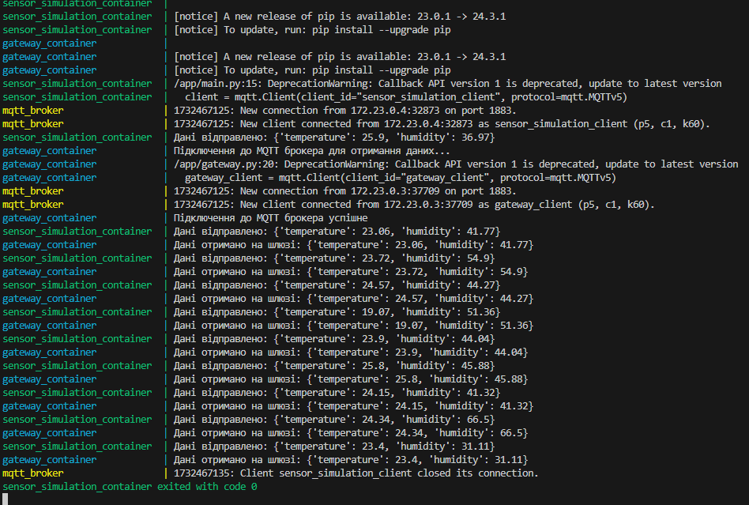

# Передавання даних від сенсору до «хмари» системи вимірювання температури.
**Завдання**: побудувати систему обробки даних від сенсорів через  допоміжні прилади/шлюзи (constrained device/gateway) для обраної системи Інтернету речей

**Результат**: робочий код який генерує дані від сенсорів

Приклад роботи

