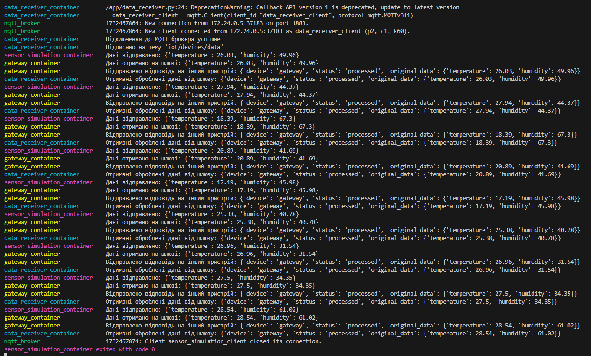

# Архітектура хмарних систем MicroGrid.
**Завдання**: побудувати клієнта для обміну даними між IoT пристроями (MQTT/CoAP) для обраної системи Інтернету речей

**Результат**: робочий код який генерує дані від сенсорів

Приклад роботи

