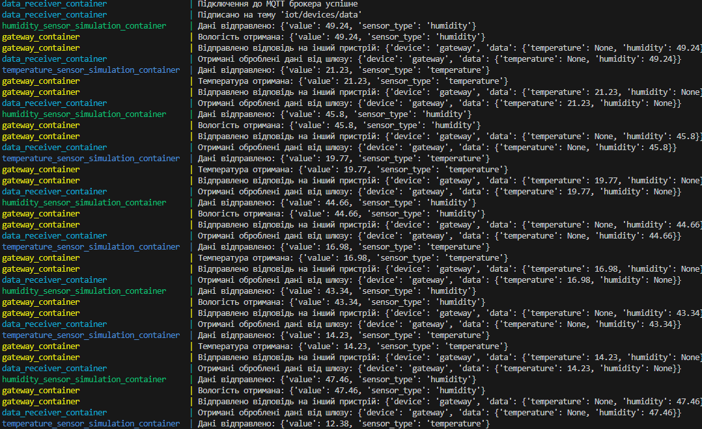

# Симуляція і обробка масиву даних MicroGrid.
**Завдання**: побудувати систему сценарію обміну даних через MQTT/CoAP через допоміжні прилади/шлюзи (constrained device/gateway) для обраної системи Інтернету речей

**Результат**: робочий код та результат продуктивності сценарію

Приклад роботи

