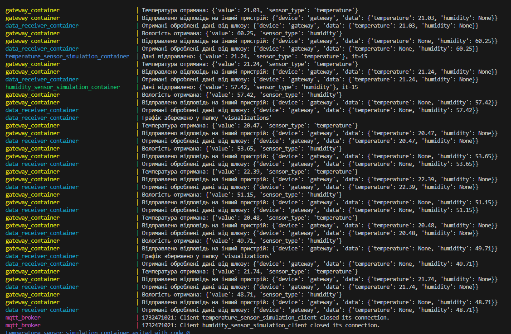
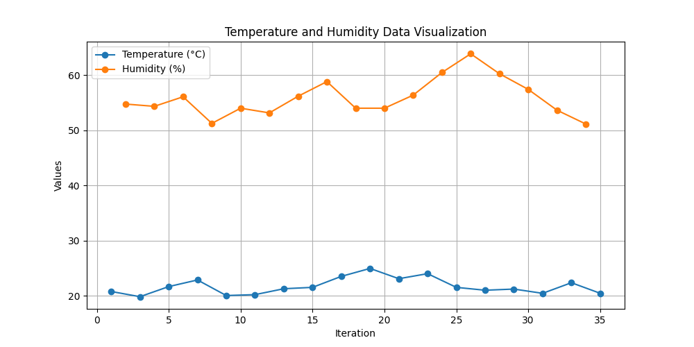

# Структурування даних.
**Завдання**: побудувати систему інтеграції з хмарним сервісом та забезпечити цілісність та візуалізацію даних для обраної системи Інтернету речей

**Результат**: робочий код та результати щодо цілісності та візуалізації даних 

Приклад роботи

Приклад графіку

